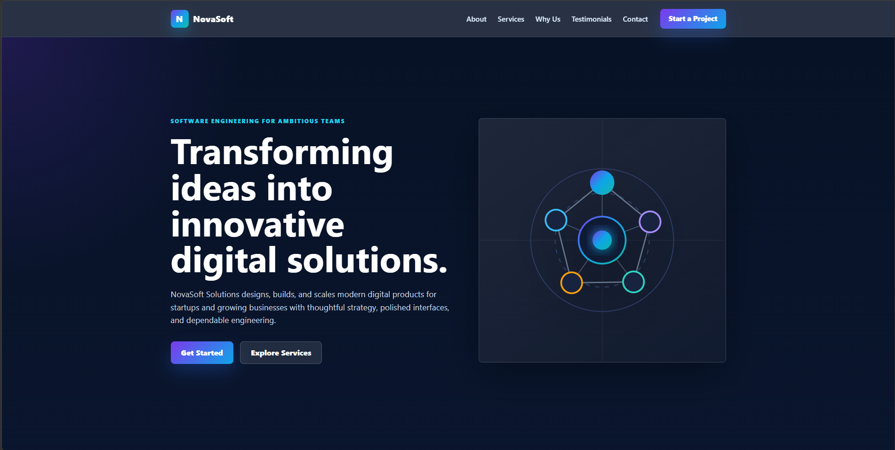
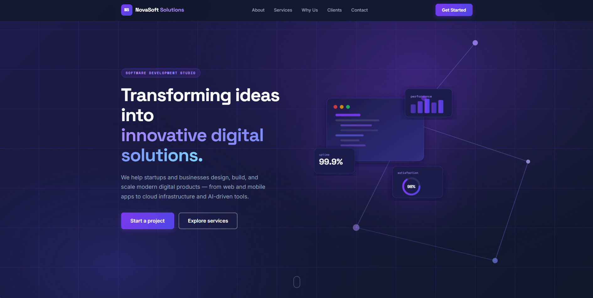

# PFO2 Front End - Prompt Engineering en Agentes de IA

## Estudiante
- **Nombre:** Yahir Ivan Perez Tolchinsky
- **Comisión**: D (Lunes)

## Objetivo del Proyecto
El objetivo es diseñar y ejecutar un prompt de alta precisión siguiendo los lineamientos de OpenAI y Anthropic, para comparar la capacidad de resolución autónoma de dos agentes de desarrollo de software al crear una Landing Page para "NovaSoft Solutions".

## Prompt Utilizado
El prompt fue estructurado siguiendo prácticas de rol, contexto, restricciones y criterios de calidad.
Estaba en duda si utilizar el español o el ingles en el prompt. Utilice el ingles como idioma pricipal en el prompt ya que me parecio que se interpretaria mas facilmente por la IA y creo que lo hace mas general y universal.

**El siguiente texto muestra el prompt usado:**

--------------------------------------------------

You are an expert Senior Front-End Developer and UX/UI Designer specializing in creating modern, responsive, and accessible landing pages using HTML5, CSS3, and vanilla JavaScript.

## Objective

Generate a complete, production-ready landing page for a fictional software development company named "NovaSoft Solutions".

The landing page must look modern, professional, clean, trustworthy, and technology-oriented.

The project must be fully responsive and work correctly on desktop, tablet, and mobile devices.

Do not ask for additional information. Make reasonable design decisions autonomously.

--------------------------------------------------

## Company Information

Company Name:
NovaSoft Solutions

Tagline:
Transforming ideas into innovative digital solutions.

Company Description:
NovaSoft Solutions is a software development company focused on building modern digital products for startups and businesses. The company specializes in web development, mobile applications, cloud solutions, artificial intelligence, API integrations, and technology consulting.

--------------------------------------------------

## Required Sections

The landing page must include the following sections in this order:

1. Header
- Company logo (text-based is acceptable)
- Navigation menu
- Call-to-action button

2. Hero Section
- Strong headline
- Supporting description
- Primary CTA button
- Secondary CTA button
- Illustration or abstract graphic generated using CSS, SVG, or open placeholder resources

3. About Us
- Brief company presentation
- Mission
- Vision

4. Services
Create six service cards:

- Web Development
- Mobile Apps
- Cloud Solutions
- Artificial Intelligence
- API Integrations
- IT Consulting

Each card must include:
- Icon
- Title
- Short description

5. Why Choose Us
Present at least four advantages such as:

- Experienced Team
- Agile Development
- Modern Technologies
- Continuous Support

6. Statistics Section

Include animated or visually highlighted statistics such as:

- 150+ Projects Delivered
- 98% Client Satisfaction
- 50+ Business Partners
- 8+ Years of Experience

7. Testimonials

Include three fictional client testimonials with:

- Client name
- Company
- Review
- Avatar placeholder

8. Contact Section

Include a styled contact form containing:

- Name
- Email
- Company
- Message
- Submit button

No backend functionality is required.

9. Footer

Include:

- Company information
- Navigation links
- Social media icons
- Copyright

--------------------------------------------------

## Design Requirements

Use a modern technology-inspired design.

Preferred palette:

- Dark Blue
- Purple
- White
- Soft Gray

Use gradients where appropriate.

Typography should be clean and professional.

Include:

- Rounded corners
- Soft shadows
- Hover animations
- Smooth scrolling
- Button transitions
- Card hover effects
- Section spacing
- Consistent alignment

Avoid overly flashy animations.

--------------------------------------------------

## Technical Requirements

Use only:

- HTML5
- CSS3
- Vanilla JavaScript

No frameworks.

No backend.

Use semantic HTML.

Separate files:

- index.html
- style.css
- script.js

Organize the code cleanly.

Use comments to identify each major section.

--------------------------------------------------

## Accessibility

Follow accessibility best practices:

- Semantic elements
- Alt text where appropriate
- Sufficient color contrast
- Keyboard-friendly navigation
- Responsive layout

--------------------------------------------------

## Responsiveness

The landing page must adapt correctly to:

Desktop
Tablet
Mobile

Use Flexbox and CSS Grid where appropriate.

--------------------------------------------------

## Code Quality

Produce readable, maintainable, well-organized code.

Avoid duplicated code.

Use meaningful class names.

--------------------------------------------------

## Final Output

Generate every required file completely.

Do not leave placeholders such as "TODO".

The project should be ready to open locally by simply opening index.html in a browser.

Produce the complete implementation without requiring additional prompts.

--------------------------------------------------

**Fin del prompt**

## Agentes Utilizados
1. **Agente 1:** Codex (OpenAI) - Modelo: GPT-5.5
2. **Agente 2:** Claude Code (Anthropic) - Modelo: Claude 4.6 Sonnet

## Resultados y Observaciones
* **Integridad del código:** Siguiendo la restricción estricta de la consigna, no se realizaron modificaciones manuales al código generado por los agentes, garantizando un análisis objetivo de su capacidad autónoma.
* **Observación sobre el idioma:** Se ha detectado que ambos agentes generaron el contenido de las landing pages en idioma inglés, si el prompt es escrito en español, la landing page sera generada en español aunque para ello, se debe traducir el prompt o pedirle a los agentes que lo hagan en ese idioma, tambien ayuda si los agentes estan configurados en el idioma deseado (en mi caso, ambos lo tengo instalados en ingles).
* **Velocidad de cada agente**: Claude tuvo una resolucion mucho mas rapida ya que demoro menos en terminar la landing page, y a mi gusto, un resultado mejor a nivel visual. 

## Capturas de Pantalla

### Landing Page - Codex
 

### Landing Page - Claude

## Deploy
https://pfo-2-front-end-theta.vercel.app/
